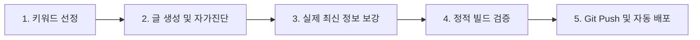

# 📝 AutoAdSense: 세션 요약 및 향후 운영 매뉴얼

오늘 세션에서 구축한 **구글 애드센스 블로그 부업 자동화 시스템**의 작동 프로세스를 정리하고, 다음 단계에서 진행해야 할 일과 장기적인 개선 방향을 수립하여 기록해 둡니다.

---

## 🔄 1. 현재 확립된 블로그 부업 자동화 프로세스

매일 글을 쓰고 발행할 때 아래 순서대로 실행하시면 오늘의 프로세스를 항상 균일한 퀄리티로 반복하실 수 있습니다.



### 1단계: 황금 키워드 선정
* [100대 키워드 보고서](file:///Users/dyl/.gemini/antigravity/brain/60e6f3a3-8f4f-4a99-90da-a83f20245ce9/keyword_analysis_report.md)를 참고하거나, 트렌드 도구(블랙키위 등)에서 조회수 대비 문서 수가 적은 세부 롱테일 키워드를 고릅니다.

### 2단계: 자동 생성 및 자가 진단 ( publish.js )
* 터미널에서 다음 명령어를 실행하여 글을 발행합니다:
  ```bash
  node publish.js --keyword="원하는 키워드" --category="카테고리명"
  ```
  * *동작 메커니즘*: AI가 글을 작성하면 스크립트가 자체 SEO 요건(1200자 이상, 표 구조화, H2 제목 수, 광고 코드, CTA 버튼)을 검사해 **80점 이상이 될 때까지 스스로 고쳐 쓰고 저장**합니다.
  * *데모(Dry-run) 모드*: API 키 세팅 전에는 고품질의 모의 기사를 자동 주입하여 빌드를 테스트해 줍니다.

### 3단계: 실제 세부 정보 보강 ( rewrite_posts.js )
* 2단계에서 임시 뼈대가 작성된 모의 글들을 실제 2026년 기준의 정확한 세부 수치(소득 한도, 서류 목록, FAQ 등)를 담은 장문으로 일괄 리뉴얼합니다:
  ```bash
  node rewrite_posts.js
  ```
  * 이 과정을 거치면 중복 연도 제거 및 슬러그 정규화가 이루어지며, 실제 독자가 신뢰할 수 있는 진짜 정보 페이지로 개선됩니다.

### 4단계: 정적 컴파일 및 무결성 검증 ( npm run build )
* 글 작성이 끝나면 빌드를 통해 사이트에 이상이 없는지 검사합니다:
  ```bash
  npm run build
  ```
  * 빌드가 끝나면 구글봇을 위한 sitemap-index.xml과 rss.xml 피드에 새 글이 자동으로 업데이트됩니다.

### 5단계: 사용자 승인 후 배포 ( Git Commit & Push )

> [!IMPORTANT]
> **사용자 사전 승인 필수 규칙 (Pre-push Gate)**
> 변경 사항이 발생했을 때 기계적으로 깃허브에 즉시 푸시하지 않습니다.
> 수정 방향과 데이터를 먼저 대화창에서 사용자에게 공유 및 설명하고, 사용자로부터 명시적인 배포 승인(예: "푸시해줘", "올려줘")을 득한 경우에만 `git push`를 통해 실서버에 반영합니다.

* 사용자 승인 후 터미널에서 다음을 실행하여 수동으로 원격지에 업데이트를 푸시합니다:
  ```bash
  git add .
  git commit -m "add: 신규 포스팅 [글제목]"
  git push
  ```

---

## 🚀 2. 다음에 해야 할 일 (Next Steps)

1. **실제 도메인 연결 및 Cloudflare Pages 연동**:
   * 본인의 GitHub 비공개 저장소를 하나 만들고 현재의 `apps/autoadsense/` 코드를 푸시합니다.
   * Cloudflare Pages 대시보드에 로그인하여 GitHub 리포지토리를 연결하고 빌드 세팅을 마칩니다. (프레임워크 프리셋: `Astro`, 빌드 명령: `npm run build`, 출력 디렉터리: `dist`)
2. **실제 환경 변수 (.env) 등록**:
   * Cloudflare Pages 환경 변수(또는 로컬 `.env` 파일)에 본인의 실제 `GEMINI_API_KEY`와 `PUBLIC_ADSENSE_ID`를 등록해 줍니다.
   * `AUTO_DEPLOY=true`로 전환하여 2단계(publish.js) 실행 즉시 Git Commit 및 실시간 배포가 100% 자동 작동하도록 활성화합니다.
3. **구글 서치 콘솔(Google Search Console) 등록**:
   * 사이트 개설 후 발급되는 `https://yourdomain.com/sitemap-index.xml` 주소를 구글 서치 콘솔에 등록하여 새 글이 올라오는 즉시 구글 검색 결과에 자동으로 색인되도록 등록합니다.
4. **구글 애드센스 승인 신청**:
   * 고품질 글이 **15~20개 이상** 쌓인 시점에 구글 애드센스 대시보드에서 사이트 승인을 신청합니다.

---

## 📈 3. 향후 개선 및 확장 방향 (Improvement Directions)

1. **실시간 트렌드 키워드 자동 크롤링 연동**:
   * `publish.js` 실행 시 직접 키워드를 치지 않아도, 매일 아침 구글 트렌드 RSS나 뉴스 RSS 피드를 크롤링하여 조회수가 치솟는 핫이슈 키워드를 스스로 추출하고 자동 포스팅하는 **'자동 이슈 트래커 스크립트'** 추가 개발.
2. **정부 복지 API 동적 데이터 매칭**:
   * 복지로 또는 대한민국 공공데이터 포털의 공공 API와 연동하여, 매년 바뀔 수 있는 복지 혜택 소득 기준선을 수동 수정 없이 실시간 API 응답값으로 본문 표에 동적 매핑해 주는 고도화.
3. **애드센스 A/B 테스트 최적화 설계**:
   * Astro 레이아웃 구조를 활용하여 광고가 소제목 위/아래에 위치할 때의 수익률(CTR) 변화를 기록하고 가장 단가가 높은 레이아웃으로 자동 조정되는 데이터 기반 최적화 모듈 연동.
